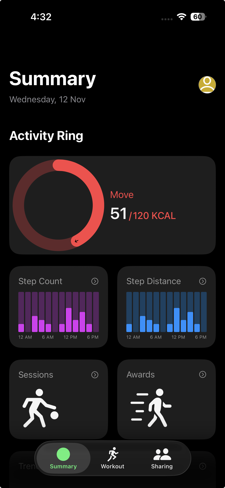
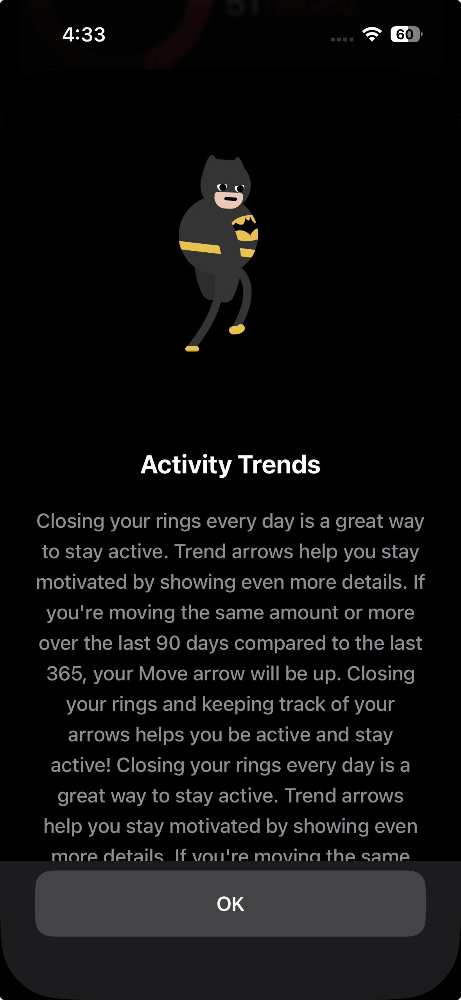
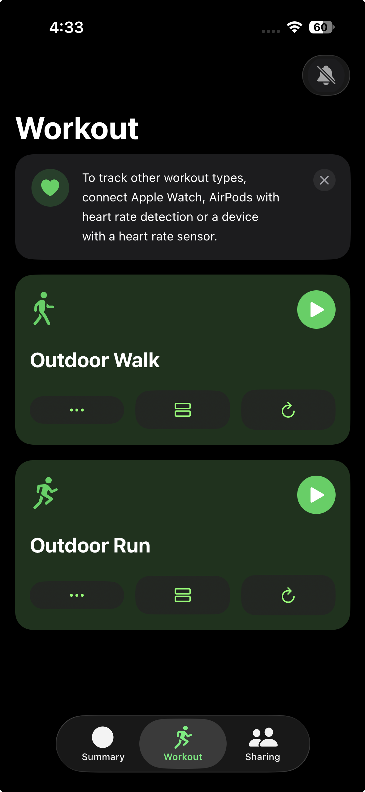
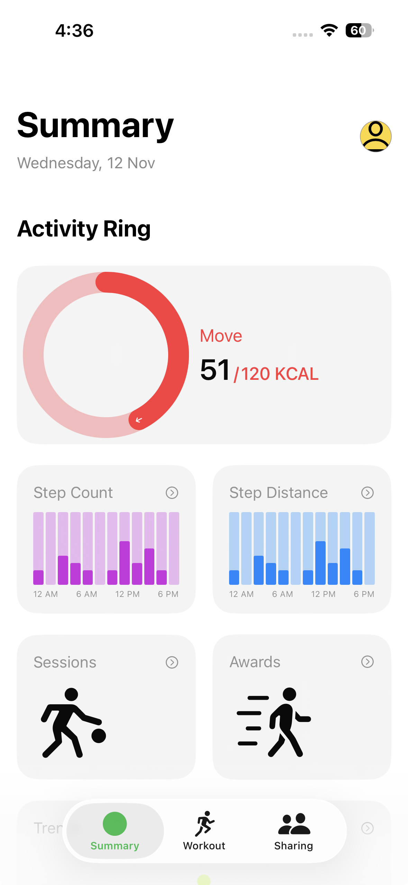
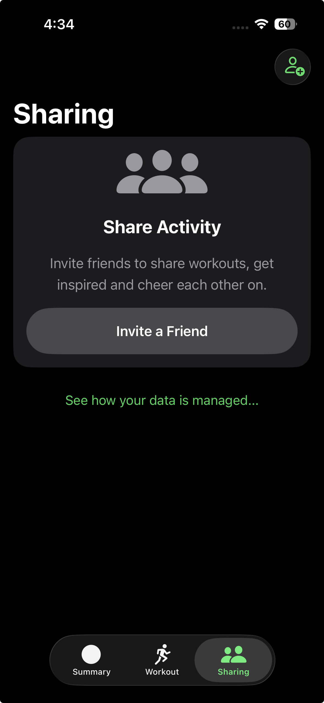
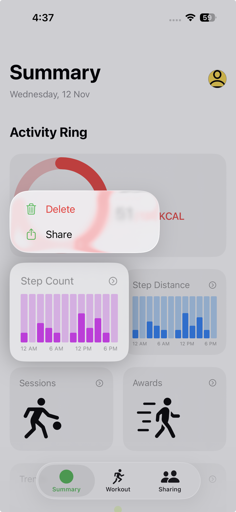
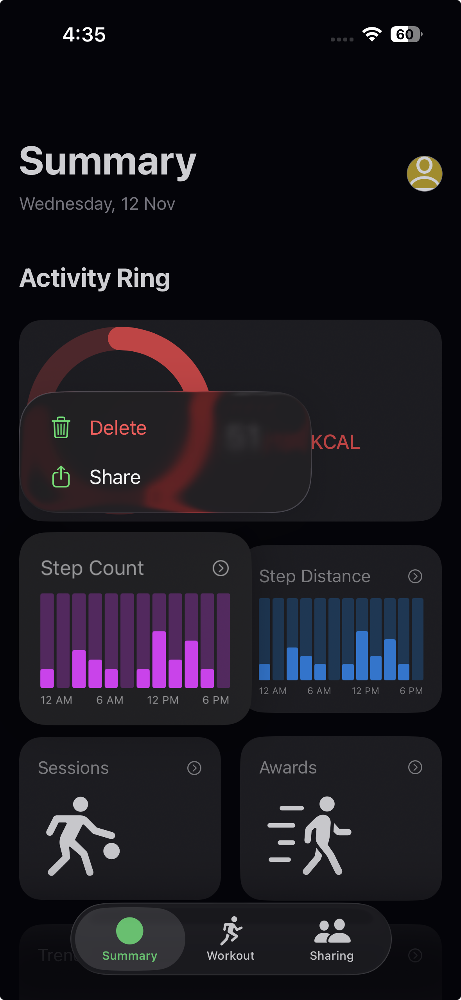

# SwiftUI UI Showcase

A collection of app interfaces built with SwiftUI.

---

## 🚀 App Designs

### 1. Daily Habit Tracker

#### 📱 Previews

| Home Page | Splash Screen | Onboarding Flow (GIF) |
| :---: | :---: | :---: |
|  |  |  |

| Login Screen | Signup Screen | Forgot Password |
| :---: | :---: | :---: |
|  |  |  |

---

### 2. Fitness Clone IOS

#### 📱 Previews

| Home Page (Dark) | Trends Screen | Trends Animation (GIF) |
| :---: | :---: | :---: |
|  |  |  |

| Workout Page | Home Page (Light) | Sharing Page |
| :---: | :---: | :---: |
|  |  |  |

| Screen Recording | Home Page Menu (Light) | Home Page Menu (Dark) |
| :---: | :---: | :---: |
|  |  |  |

#### 🚀 Presentation

[View Project Presentation](./readme-assets/Fitness/fitness_app_presentation)

---
---

## 🛠️ Technology Stack

* SwiftUI
* Swift
* Xcode

## 🔧 How to Run This Project

1.  **Clone the Repository**
    ```bash
    git clone [https://github.com/vijaydhakal/Swift-Gallery.git](https://github.com/vijaydhakal/Swift-Gallery.git)
    ```
2.  **Open in Xcode**
    Open the `SwiftGallery.xcodeproj` file.
3.  **Run the App**
    Select an iOS Simulator and press **Run** (`Cmd + R`).


